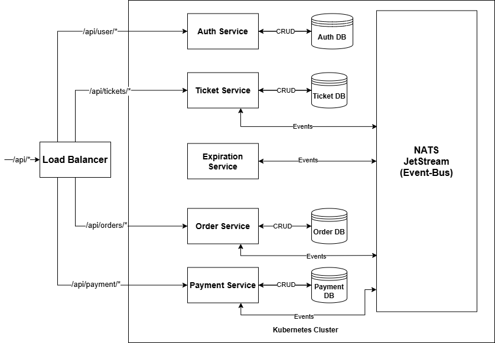
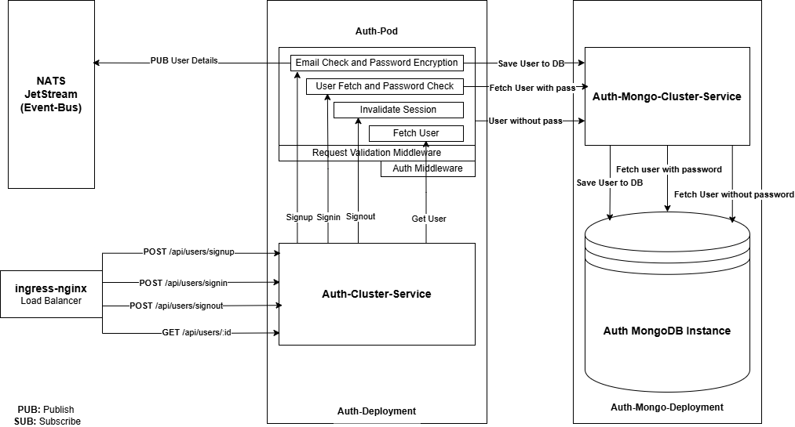
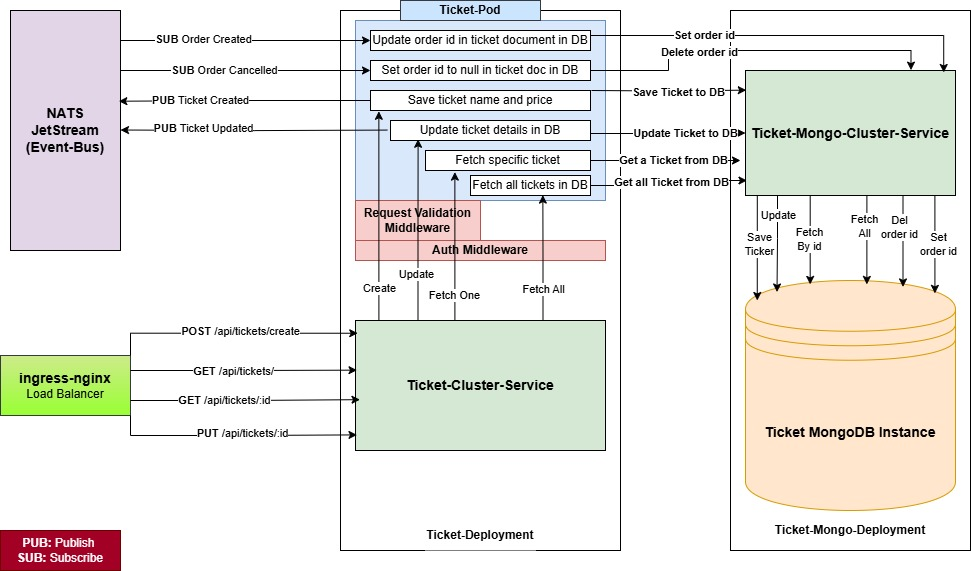
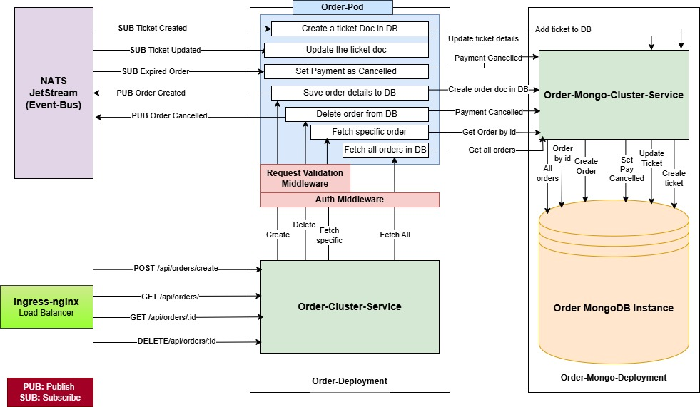
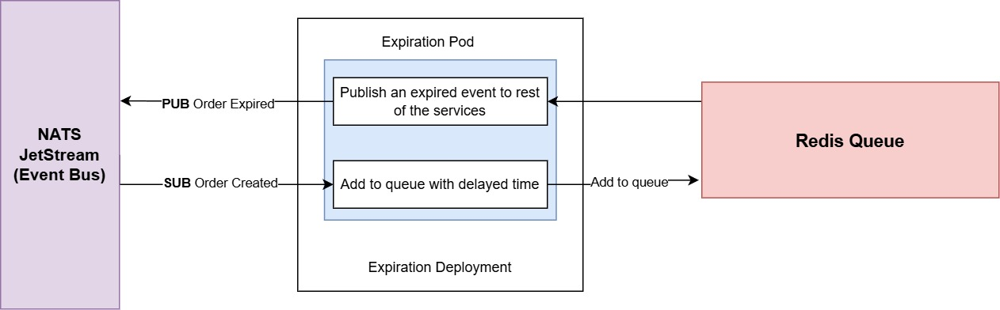
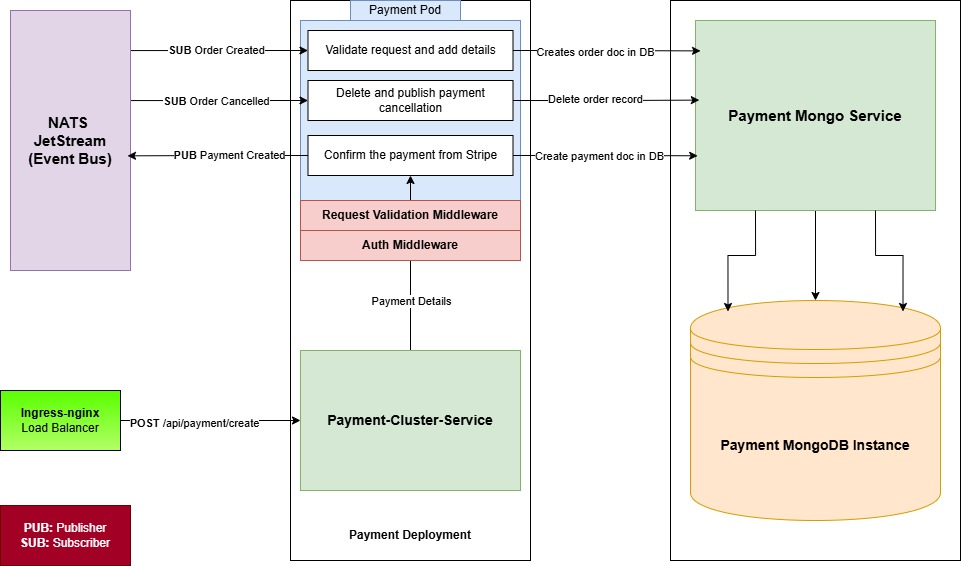

# Ticketing Microservices

This repository contains a ticketing microservices application built using Node.js, TypeScript, and MongoDB. The application is designed to manage ticket sales, orders, and user authentication in a scalable and efficient manner.

## Table of Contents

- [Architecture](#architecture)
- [Services](#services)
- [Technologies](#technologies)
- [Getting Started](#getting-started)
- [Environment Variables](#environment-variables)
- [Running the Application](#running-the-application)
- [Testing](#testing)
- [Deployment](#deployment)
- [Contributing](#contributing)

## Architecture

The application follows a microservices architecture, consisting of the following services:

- **Auth Service**: Handles user authentication and authorization.
- **Tickets Service**: Manages ticket creation, updates, and retrieval.
- **Orders Service**: Processes and manages orders for tickets.
- **Expiration Service**: Manages ticket reservation timeouts.
- **Client Service**: Frontend application built with Next.js.



## Services

### Auth Service
- **Path**: `/api/users/*`
- **Description**: Manages user registration, login, and JWT token generation.
- **Details**: 
  - Supports user registration with email and password.
  - Implements password hashing for security.
  - Provides JWT tokens for authenticated sessions.
  - Includes middleware for protecting routes.



### Tickets Service
- **Path**: `/api/tickets/*`
- **Description**: Handles ticket creation, retrieval, and updates.
- **Details**: 
  - Allows users to create new tickets with details such as event name, date, and price.
  - Supports ticket updates and deletion.
  - Provides endpoints for retrieving ticket information and availability.



### Orders Service
- **Path**: `/api/orders/*`
- **Description**: Manages order creation and status updates.
- **Details**: 
  - Processes orders for tickets, linking them to user accounts.
  - Supports order status updates (e.g., pending, completed, canceled).
  - Integrates with payment gateways for transaction processing.



### Expiration Service
- **Path**: `/api/expiration/*`
- **Description**: Handles ticket expiration and reservation management.
- **Details**: 
  - Manages the lifecycle of ticket reservations.
  - Automatically expires reservations after a set time.
  - Sends notifications to users about reservation status.



<!-- ### Client Service
- **Path**: `/`
- **Description**: Frontend application for users to interact with the ticketing system.
- **Details**: 
  - Built with Next.js for server-side rendering and optimized performance.
  - Provides a user-friendly interface for browsing events and purchasing tickets.
  - Integrates with the backend services for seamless user experience.

 -->

### Payment Service
- **Path**: `/api/payment/*`
- **Description**: Manages payment processing for ticket orders.
- **Details**: 
  - Integrates with payment gateways for processing transactions.
  - Handles payment status updates and notifications.
  - Ensures secure handling of payment information.
  - Provides endpoints for initiating and confirming payments.



## Technologies

- **Node.js**: JavaScript runtime for building server-side applications.
- **TypeScript**: Superset of JavaScript that adds static types.
- **Express.js**: Web framework for building APIs.
- **MongoDB**: NoSQL database for data persistence.
- **NATS**: Lightweight messaging system for event-driven communication.
- **Docker**: Containerization for easy deployment.
- **Kubernetes**: Orchestration for managing containerized applications.

## Getting Started

### Prerequisites

- Node.js (v14 or higher)
- MongoDB (local or cloud instance)
- Docker (for containerization)
- Kubernetes (for orchestration)

### Installation

1. Clone the repository:
   ```bash
   git clone https://github.com/yourusername/ticketing-microservices.git
   cd ticketing-microservices
   ```

2. Install dependencies for each service:
   ```bash
   cd auth
   npm install
   cd ../tickets
   npm install
   cd ../orders
   npm install
   cd ../expiration
   npm install
   cd ../client
   npm install
   ```

## Environment Variables

Each service requires specific environment variables. Create a `.env` file in each service directory with the following variables:

### Auth Service

- **MONGO_URI**: MongoDB connection string.
- **JWT_SECRET**: Secret key for signing JWT tokens.
- **PORT**: Port on which the service will run.

### Tickets Service

- **MONGO_URI**: MongoDB connection string.
- **PORT**: Port on which the service will run.

### Orders Service

- **MONGO_URI**: MongoDB connection string.
- **PORT**: Port on which the service will run.

### Expiration Service

- **MONGO_URI**: MongoDB connection string.
- **RESERVATION_TIMEOUT**: Time in minutes before a reservation expires.
- **PORT**: Port on which the service will run.

### Client Service

- **API_URL**: Base URL for the backend services.
- **PORT**: Port on which the client will run.

## Running the Application

To run the application, you can use Docker Compose. Make sure you have Docker and Docker Compose installed, then run the following command in the root directory of the project:

```bash
docker-compose up
```

This will start all the services defined in the `docker-compose.yml` file.

## Testing

To run tests for each service, navigate to the service directory and run:

```bash
npm test
```

## Deployment

For deployment, you can use Kubernetes to manage the services. Ensure you have a Kubernetes cluster set up and use the provided Kubernetes manifests to deploy each service.

## Contributing

Contributions are welcome! Please open an issue or submit a pull request for any improvements or bug fixes.


